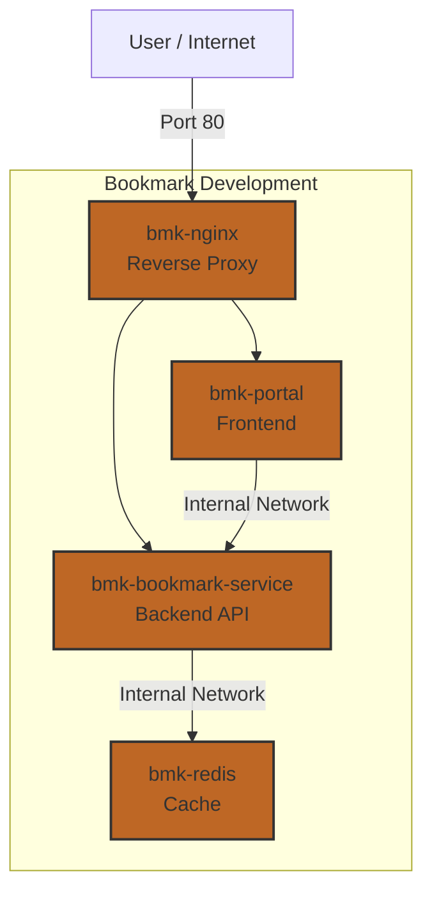

# Bookmark Deployment

This repository contains the Docker Compose orchestration configuration for the **Bookmark Application ecosystem**. It manages the deployment of the backend service, frontend portal, Redis cache, and Nginx reverse proxy.

## 🏗 Architecture

The deployment consists of four main containers orchestrated via `docker-compose.yml`:

| Service | Container Name | Image | Description |
| :--- | :--- | :--- | :--- |
| **Nginx** | `bmk-nginx` | `nginx:alpine` | Reverse proxy entry point (Port 80). |
| **Portal** | `bmk-portal` | `ebvn/bookmark-app-portal:dev` | Frontend application. |
| **Backend** | `bmk-bookmark-service`| `vincenttien/bookmark-service:dev`| Core API service. |
| **Redis** | `bmk-redis` | `redis:alpine` | Caching layer for the backend. |



## 📂 Project Structure

```text
BookmarkDeployment/
├── infra/
│   └── nginx/
│       └── nginx.conf          # Nginx configuration (mounted to /etc/nginx/conf.d/default.conf)
├── services/
│   └── bookmark_service/
│       └── .env                # Environment variables for the backend service
├── docker-compose.yml          # Main orchestration file